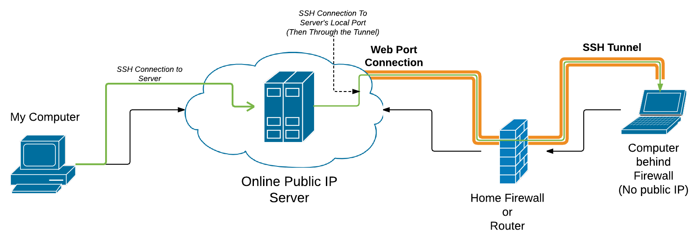
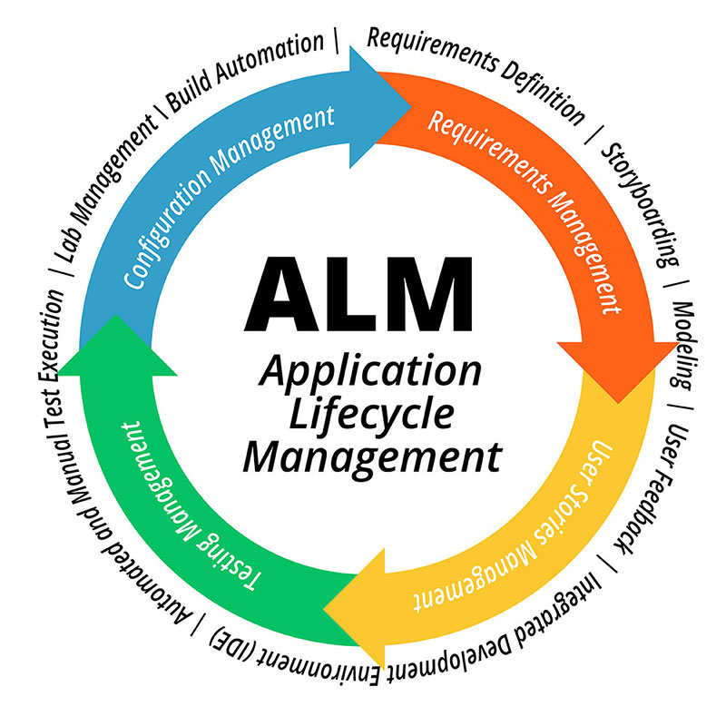
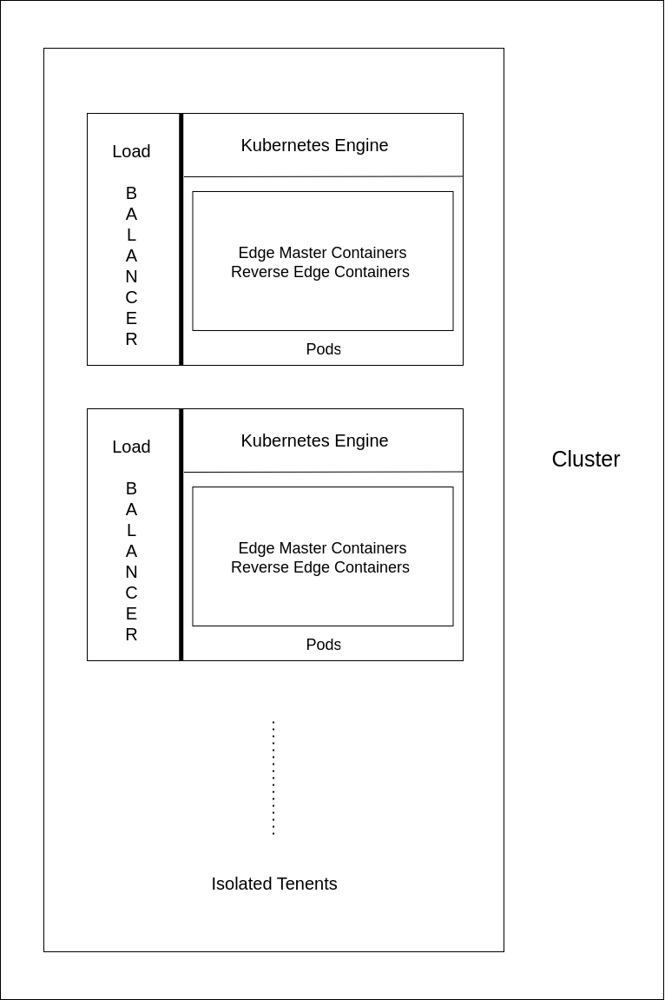

# Proposed Approach

## Introduction
Keeping our aim to control Device, Data and Application Lifecycle we need to think of suitable Technical Stack and architecture of the system which will work efficiently. Talking about device, most important thing is to maintain and debug software problems which can only be solved by shell access. Achieveing shell access to a device which is under strict traffic rules and behind multiple firewalls is not possible if outsider is trying to access. The initiation of connection should be started by the client machine and the global server should be able to interact using the connection. Managing Data collected from edge devices is tough when number of edge devices grow and we need efficient mechanism to scale our backend according to the incoming traffic. Application Lifecycle Management is important to manage remotly deployed application. Though we have Shell access and can manage application from shell but we cant do this for each device where application is already installed. Deployment of newer version of application on all the devices where it is already deployed or we intend to deployed should also be abstracted to provide end user nocode management of application.

## Device
Managing device is all about shell access as discussed in introduction, and we can achieve this using multiple ways. It is necessary to remember that connection will be initiated by the client machine, so the protocol we will be using should be Duplex and simple http or https protocols cannot be used here. Instead here we need to opt for Websockets and MQTT. We can also use SSH. Conventionally MQTT is used for exchanging messages but Websockets has some functionalities which can be useful to us like RPC. We will discuss about options available to us.

### Reverse SSH Tunnel

  

As discussed earlier connection should be initiated by the client machine, here client machine initiates SSH connection(tunnel) and allows server to SSH to client machin from the same tunnel created. This is how Reverse Tunnel is achieved.

### Websocket

Similar to Reverse SSH Tunnel, websocket client on client machine will connect to the websocket server on the server execute whatever the server sends on the client. But it is not the true shell but websocket acts as a vendor to exchange output and the commands between client and the server. Here developer needs to care about the security of the connection.

### Comparision

Both SSH Tunnel and Websocket will satisfy the need talking about security, SSH has two layed security which means attacker needs to know all two pairs of SSH keys which is highly unlikely and in case of web sockets, developer needs to take care of the security of websocket connection. Talking about security after connection, client gets connected to Secure Shell of server using some user. Now, client has access to some user. So it is necessary to configure that user to have minimum privileges so that even if client in comprimised in some way then there is no way to manipulate server. This issue will not happen in websockets as there is no server shell on client side. 

Considering scaling, SSH tunnels can be created one port per client as there shouldn't be any collision but websocket servers can handle multiple clients per port.

## Data

Many service providers create services which are generic and try to decompose components of application at granular level to give costumer personalised service which can mold as customer wants. In the similar way where services are developed in a granular way, data also needs to fit the architecture. 

Customer may have data of multiple types and related to any deployed application or concerned to working of the management framework. This data should be stored, archived and alalyzed to understand and find meaningfull visualisations. So, meaning of meaningfull in meaningfull visualisations can be different for different customers. 

Managing huge data and keeping robustness on the way makes us use scalable and cluster and distributed database systems. Also caching is important to reduce the overhead of quering same data again and again.

Talking about databases, we can prefer Mongo DB here as already many IoT based enterprices are using it and iot satisfies our requirement i.e it can scall very well as we can launch multiple instances(horisontal scale) as well as we can make it distributed. Being NoSQL we dont need to think about the structure and multiple tenents can store any type of data in any structure. 

What we need to think more here is about how to scale as we will have huge amount of incoming data traffic and relatively less outgoing data traffic.  

## Application

As mentioned we are trying that our framework fulfills most of the tenents and their requirements even if they work on different applications and data. Developers may stop, restart, start or update application and to support this we need to define the Lifecycle of an Application. Application lifecycle contains all the necessary scripts and references to control application from its initiation to its termination on the system. Many vendors have moved towards automation till the depth of Infrastructure as a Code so Lifecycle as Code is pretty simple compariatively. Say a YAML file tells us how the application should be started on a Linux system and how it should be stopped, its file paths and everything that it needs without accessing each system. Also there may be multiple systems that customer intends to deploy application so manageing system fleets are also important.

  

### AWS IoT Core

Amazon IoT core provides platform to control application deployed on fleet, to start, stop, update and as well connect to devices remotly using their proxy as discussed in Device section in this paper. They define application lifecycle in a YAML file which they call as Recipie and files that support running of the program as Artifacts. 

## Architecture
As we discussed the system should be highly scalable and ensure availablity and reliablity for multitenents. So, for scaling we can use some latest technologies like Kubernetes and while developing we can use microservices architecture. Using microservices architecture will surely boost the development and reduce development time.

  

