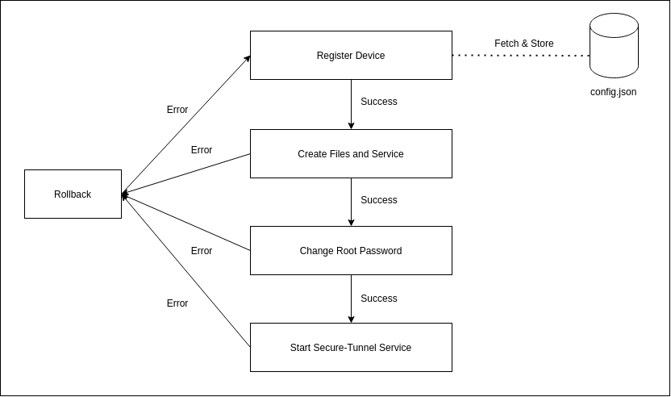

# Client Side Configuration

Client side components are supposed to to executed on the remote client which is situated behind NAT.

## Components

### **1. Prerequisites Script:**

    This script verifies all the dependencies installed and suggests user to install remaining dependencies.

### **2. Client Installation Script**

    Client Installation Script is responsible to initiate client, lock root and create a daemon service.

## Client Prerequisites

* ### OpenSSH-Client, OpenSSH-Server and SSH Key Pair

    Basic client, server OpenSSH linux packages are necessary to create ssh tunnel and SSH key pair to authorize the connection.

* ### Autossh

    Open source package to keep reverse shell persistent.

* ### Python 3

    Python 3 should be installed and  `python` should symlink to `python3` in shell environment.

    **Requirements**:
    1. Requests - Module used to communicate with server.

All the prerequisites are installed in **_setup.sh_** which should be executed by **_root_** user.

## Client Installation

  

* ### Registering Device

    Device registeration is necessary to store client in Database, important generated password of root user and ssh public key. Also we get dedicated port of server and client id which are important part of further communication and configuration.

* ### Internal Files and Service Creation

    Configuration and main program is copied to **/root/Secure-Tunnel/** path. Service is created to keep the secure tunnel process active and to achieve persistence.

* ### Root Password Change

    **Root** password is changed to random string that only server knows now and client cannot find it out.
