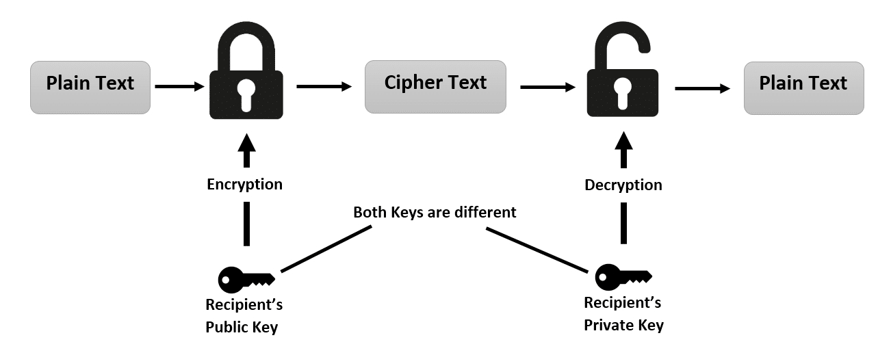
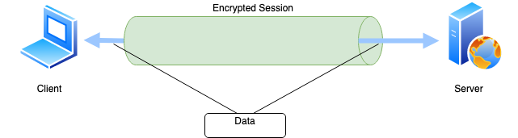
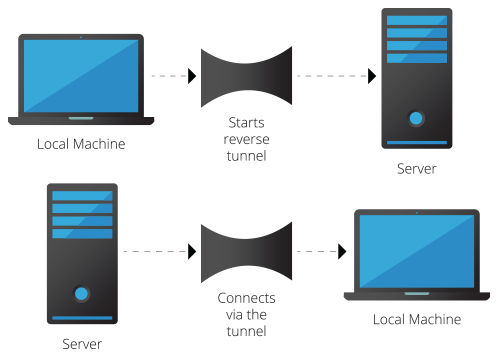

# Secure Tunneling Solution

## Introduction

In today's era of big data and processing, we are finding ways to distribute our computaions to reduce point of failures and processing huge data parallely. Developers are moving away from centralised systems with high data traffic prices and adopting decentralised systems and sharing only data that actually matters like loosely copuled systems. This has impacted IoT systems. IoT conventionally process data on cloud which is ofcourse a centralised system. Rise of Edge Computing with IoT has reduced processing charges on cloud but increased hardware charge as Edge Devices need more computing power to process huge data collected by IoT devices. Also in parallel these Edge devices compute and processed data is pushed which is again simiar to decentralised system.

Accessing these Edge Devices remothely is again a challenging thing, because they reside generally within firewalls with strict traffic security rules. Accessing here means getting their shell access to debug/modify things remotly.

## Secure Shell (SSH)

Secure shell is a cryptographic network protocol for operating network services securely over an unsecured network. So as the definition tells us, we can share services securely over insecure network using SSH and these services can be any process.

To undersatnd the encryption strategy behind SSH, lets see what RSA cryptosystem means and how data is sure.

### RSA (Rivest–Shamir–Adleman)

In RSA, encryption and decryption is only possible of we have key pair, a Public Key and and a Private Key. Public and private keys are complementry i.e any thing encrypted with Public key can be only decrypted with Private key which are generated in pairs.

  

Here the Public and Private keys are distinct and predicting other key if have one key is almost impossible. As public and private keys are distinct, RSA is tye of Asymmetric Encryption.

Let's talk more about the key pair,

* Public Key: As name suggests it is a key that can be shared in public as there is no harm and predicting private key from public key is almost impossible. Let's see what Public key comprises of:

      n = pxq
      e = Small exponent

      where,
      1. p and q are huge prime numbers
      2. e is not the factor of pxq
      3. 1 < e < Φ(pxq)
      4. Φ(n) is value of Euler's Totient of n

* Private Key: As name suggests it is as key that is to be kept secret sharing it is critical. Let's see what Private key comprises of:

      d = (k*Φ(n) + 1)/e
      e = Small Exponent

      where,
      1. k is any integer
      2. n = pxq
      3. Φ(n) is value of Euler's Totient of n

Now, lets operate with some message `m` that is to be encrypted with public key and decrypted with private key.
To encrypt `m` and get cipher text `c`, we have only `n` and `e`

**c = me % n**

To decrypt cipher text `c` to original message, we need both public and private key, so we have variables `n`, `e` and `d`

**m = cd % n**

### SSH to a device

Any device which is interested in running SSH network protocol should have Public and Private key which can be generated using following command:

    $ ssh-keygen

Key pair is generated in ``~/.ssh/`` directory. Now the device will use these keys for encrypted communication. The is one more file which plays significant role in SSH authentication which is ``~/.ssh/authorized_keys``. _authorized_keys_ file stores public keys of devices that are trusted and can SSH into the device i.e public key of other trusted devices. And this is one way to authenticate devices(or users) who can SSH into our device.

Another way is to share Private key which is dangerous because then they can read all the encrypted message that are supposed to read by us. So this way should be avoided.

### SSH Tunnel

As we discussed, SSH can share services(expose) of one device to other. So there can be multiple services running and the term for SSH connectn is SSH Tunnel from which we can exchange data securly.

  

### Reverse SSH

Reverse SSH is just SSH Tunnel inside SSH Tunnel. Concept here is to share/expose SSH service of first device to second device so that other device can access shell of first device.

  

So, the reverse shell is double encrypted due to exchange of data within SSH Tunnel layered on one another. If attacker wants to comprimise the reverse ssh tunnel, he needs two key pairs, of client and server which is very unlikely to happen if client and server are precautious.

## Problem

Edge devices generally reside dehind NAT and Firewalls so getting shell into them is problem. They do not have Static IPs and firewall rules filter most of the connections. We need to access Edge devices for maintainence/debugging.

# Solution

## Introduction

We can use Reverse SSH tunnel, which will be initiated by Edge device to our Server and expose the SSH service which we will access from server. But we need to think of multiple devices, server load and persistency of SSH tunnels. Let's see how to manage them.

* Multiple Devices: For exposing SSH service to server, we need to map ports of SSH service on Client(generally port 22) to some port of server, so we need to keep track of mapped port and unmapped port to avoid reverse ssh connection on same port.

* Server Load: We can run multiple ssh services on server or maybe use multiple servers i.e horizontal scale servers as needed. Usage of Kubernetes like services to manage this is recommended.

* Persistency: SSH tunnels are generally non persistent because they become inactive if no packets are exchanged for some amount of time. To achieve persistency, client i.e edge devices should keep the tunnel active. `Autossh` package is recommended to use to achieve this.

Now, let's see server side and client side configuration to setup such functionality.

## Comparing with top IoT tunneling services

|               | Our Product | AWS Secure Tunnel | Google IoT Core | Balena |
|---------------|-------------|-------------------|-----------------|--------|
| Cost Effective         |       ✓      |         ✕          |       ✕          |    ✕    |
| Security      |      ✓       |         ✓          |         ✓        |    ✓    |
| Tunneling Availablity |      ✓       |          ✓         |         ✕        |    ✓    |
| Speed |      ✓       |         ✓          |        ✓         |    ✕    |
| Data Analysis Dashboard |      ✓       |         ✕          |        ✕         |    ✕    |
| Deployed Code Security |      ✓       |         ✕          |        ✕         |    ✕    |

Our most interesting feature is preventing read access of code from other users of IoT device especially for patentised products which is not available on any IoT service providing platform.

## Client Side Configuration

Client side components are supposed to to executed on the remote client which is situated behind NAT.

### Client Components

#### **1. Prerequisites Script:**

    This script verifies all the dependencies installed and suggests user to install remaining dependencies.

#### **2. Client Installation Script**

    Client Installation Script is responsible to initiate client, lock root and create a daemon service.

### Client Prerequisites

* #### OpenSSH-Client, OpenSSH-Server and SSH Key Pair

    Basic client, server OpenSSH linux packages are necessary to create ssh tunnel and SSH key pair to authorize the connection.

* #### Autossh

    Open source package to keep reverse shell persistent.

* #### Python 3

    Python 3 should be installed and  `python` should symlink to `python3` in shell environment.

    **Requirements**:
    1. Requests - Module used to communicate with server.

All the prerequisites are installed in **_setup.sh_** which should be executed by **_root_** user.

### Client Installation

  

* #### Registering Device

    Device registeration is necessary to store client in Database, important generated password of root user and ssh public key. Also we get dedicated port of server and client id which are important part of further communication and configuration.

* #### Internal Files and Service Creation

    Configuration and main program is copied to **/root/Secure-Tunnel/** path. Service is created to keep the secure tunnel process active and to achieve persistence.

* #### Root Password Change

    **Root** password is changed to random string that only server knows.

## Server Side Configuration

Some server side cmponents are critical and need to be configured correctly to ensure security.

### Server Components

#### **1. Dashboard**

    We have used Streamlit framework here to create Dashboard wherein we can easily scale for newer functionalities. 

#### **2. Flask API**

    Flask API here ensures the data exchange between Database, Streamlit Server and Client.

#### **3. Cron Jobs**

    Cronjobs for backing up and data and batch processing and appliction specific jobs should be configured.

### Dashboard Setup

* Streamlit server is to be run in python virtual environment, we have used `pipenv` and `python 3.8` to ensure all the dependencies are installed.
* All dependencies are included in `pipfile` and virtual environment chan be easily regenerated using **_pipenv shell_** command.

### Flask API Setup

* Flask API is pretty much easy to setup, just enter **_flask run_** in the _watchman_ directory by setting **_FLASK_APP_** env variable as `app.py`.

### Database Server

**Create Admin User:**

    use admin
    db.createUser(
        {
        user: "admin",
        pwd: "iot123",
        roles: [ { role: "userAdminAnyDatabase", db: "admin" } ]
        }
    )

**Create Watchman User:**

    use watchman
    db.createUser(
        {
            user: "watchman",
            pwd: " ",
            roles: [ { role: "readWrite", db: "watchman" },
                    { role: "read", db: "reporting" } ]
        }
    )
